# Database ERD

Auto-derived from the 192 `src/**/entity/*.entity.ts` files (180 concrete tables + 12 abstract
base classes). This repo declares almost no TypeORM relation decorators — associations live as
plain `*Id` columns, so the edges below are inferred from column naming and are **not** enforced
FK constraints in every case. `DATA_SCHEMA.md` remains the authoritative per-column reference.

Reading the diagrams:

- `||--o{` = one-to-many, `}o--o{` = join/many-to-many, `||--o|` = optional one-to-one.
- Nearly every table also carries `tenant_id` → `tenants`. That edge is drawn only in the
  **Tenancy & access** diagram; assume it everywhere else rather than reading 180 lines of it.
- Not foreign keys despite the `*Id` suffix: `roomId` (LiveKit room string), `externalId`
  (Auth0/upstream id), `correlationId`, `invocationId`, `egressId`, `providerMessageId`,
  `lastJobId`, `patchId`.

---

## 1. Tenancy, users & access control

```mermaid
erDiagram
    tenants ||--o{ users : "tenant_id"
    tenants ||--o{ admin_tenants : ""
    tenants ||--o{ tenant_cohorts : ""
    tenants ||--o{ scenario_tenants : ""
    tenants ||--o{ track_tenants : ""
    tenants ||--o{ case_tenants : ""
    tenants ||--o{ scenario_path_tenants : ""
    tenants ||--o{ roleplay_spec_tenants : ""
    tenants ||--o{ badge_tenants : ""
    tenants ||--o{ dashboard_tenants : ""
    tenants ||--o{ variety_profile_attachments : ""

    users ||--o{ admin_tenants : ""
    users ||--o| user_preferences : ""
    users ||--o{ user_groups : ""
    users ||--o{ admin_feature_toggles : ""
    users ||--o{ audit_logs : ""
    users ||--o{ user_daily_scores : ""
    users ||--o{ simulation_credits : ""
    users ||--o{ tenant_cohort_members : ""

    groups ||--o{ user_groups : ""
    groups ||--o{ group_permissions : ""
    permissions ||--o{ group_permissions : ""
    groups ||--o{ badge_groups : ""
    groups ||--o{ dashboard_groups : ""

    tenant_cohorts ||--o{ tenant_cohort_members : ""
    tenant_cohorts ||--o{ scenario_cohort_restrictions : ""
    tenant_cohorts ||--o{ track_cohort_restrictions : ""
    tenant_cohorts ||--o{ case_cohort_restrictions : ""

    badges ||--o{ badge_users : ""
    badges ||--o{ badge_groups : ""
    badges ||--o{ badge_tenants : ""
    users ||--o{ badge_users : ""
```

> A user's role is `user_groups` → `groups` → `group_permissions`; there is no `role` column.

---

## 2. Scenarios & versioning (`src/learn`)

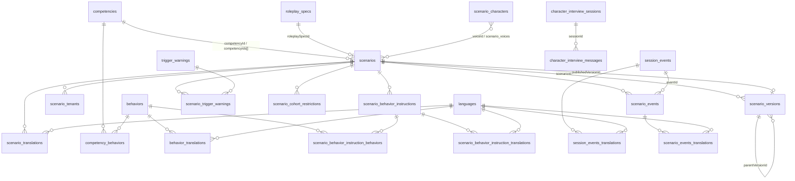

---

## 3. Scenario sessions — the runtime hub

`scenario_sessions` is the single most referenced table (20 tables carry `scenarioSessionId`).

```mermaid
erDiagram
    scenarios ||--o{ scenario_sessions : "scenarioId"
    scenario_versions ||--o{ scenario_sessions : "scenarioVersionId"
    users ||--o{ scenario_sessions : "counselorId"
    scenario_path_session_items ||--o| scenario_sessions : ""
    case_session_items ||--o| scenario_sessions : ""
    track_item_progress ||--o| scenario_sessions : ""

    scenario_sessions ||--o| scenario_session_details : ""
    scenario_sessions ||--o{ scenario_session_messages : ""
    scenario_sessions ||--o{ scenario_session_events : ""
    scenario_sessions ||--o{ scenario_session_feedbacks : ""
    scenario_sessions ||--o{ scenario_session_lifecycle_events : ""
    scenario_sessions ||--o{ scenario_session_behavior_instructions : ""
    scenario_sessions ||--o{ scenario_session_recordings : ""
    scenario_sessions ||--o| scenario_session_start_metrics : ""
    scenario_sessions ||--o{ scenario_session_turn_metrics : ""
    scenario_sessions ||--o{ scenario_session_chats : ""
    scenario_sessions ||--o{ scenario_session_message_tags : ""
    scenario_sessions ||--o{ llm_usage : ""
    scenario_sessions ||--o{ glossary_adherence_reports : ""
    scenario_sessions ||--o{ roleplay_rubric_scores : ""
    scenario_sessions ||--o{ roleplay_director_events : ""
    scenario_sessions ||--o{ scenario_session_reviews : ""

    scenario_session_messages ||--o{ scenario_session_message_tags : "messageId"
    scenario_session_tags ||--o{ scenario_session_message_tags : "tagId"
    scenario_session_messages ||--o{ scenario_session_message_translations : ""
    scenario_session_events }o--|| session_events : "eventId"
    scenario_session_behavior_instructions }o--|| scenario_behavior_instructions : ""
    scenario_session_chats ||--o{ scenario_session_chat_messages : "chatId"
    users ||--o{ scenario_session_chats : "userId"
    users ||--o{ scenario_session_messages : "senderId"
    users ||--o| learner_supervisor_memory : "counselorId"
    scenario_sessions ||--o| learner_supervisor_memory : "lastScenarioSessionId"
```

### Judgments & evaluation over sessions

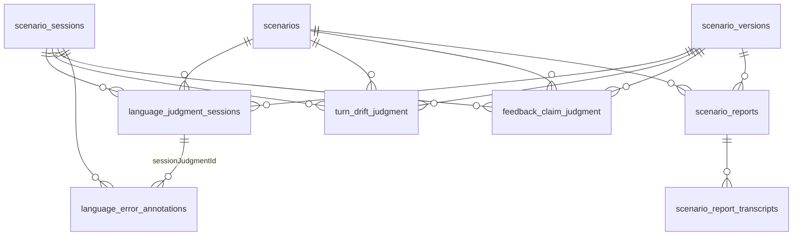

### Session review threads (mirrored for scribe sessions)

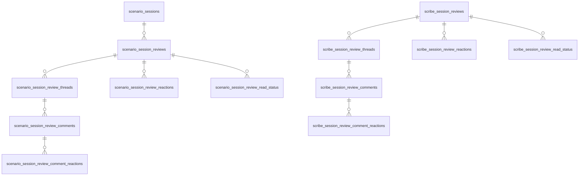

> Both review trees extend the abstract `src/review/entity/base-review*.entity.ts` classes; the
> parent-child columns (`reviewId`, `threadId`, `commentId`) are declared there, not in the
> concrete entities.

---

## 4. Learning containers — tracks, cases, scenario paths

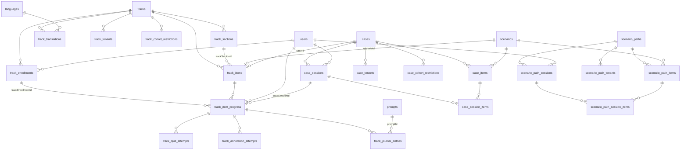

---

## 5. Roleplay Studio

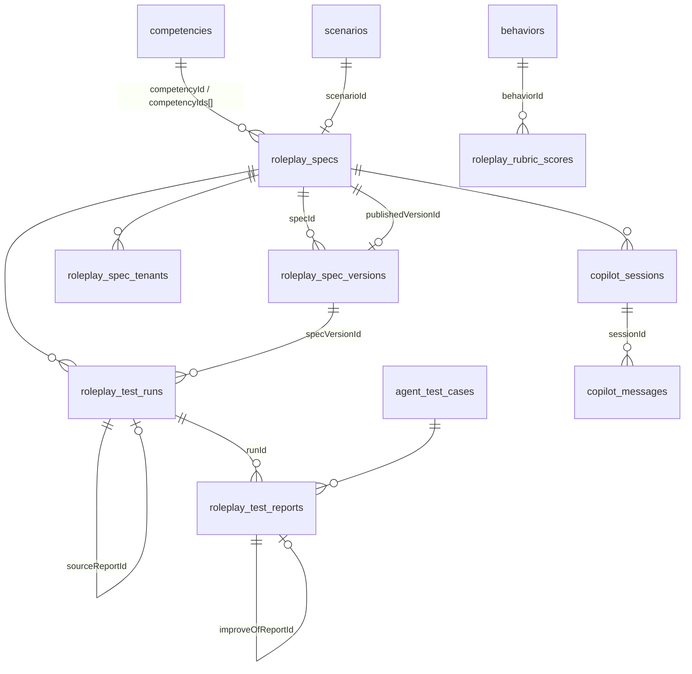

---

## 6. Chat / scribe & telephony

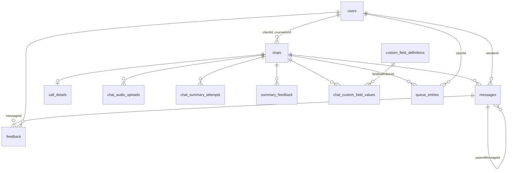

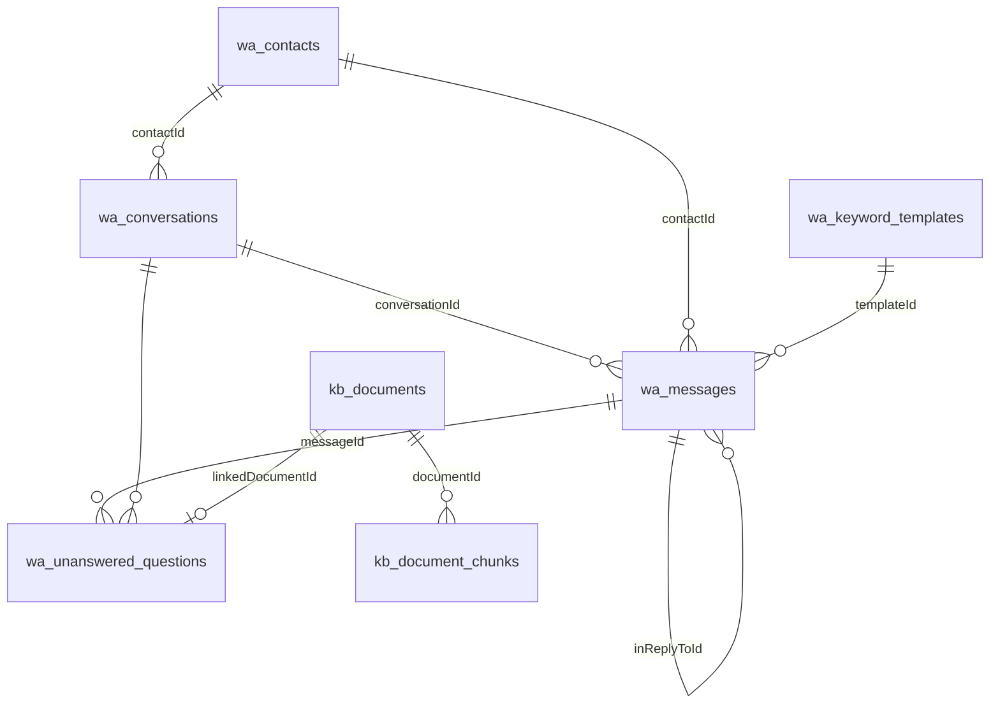

---

## 7. Language, glossary & prompts

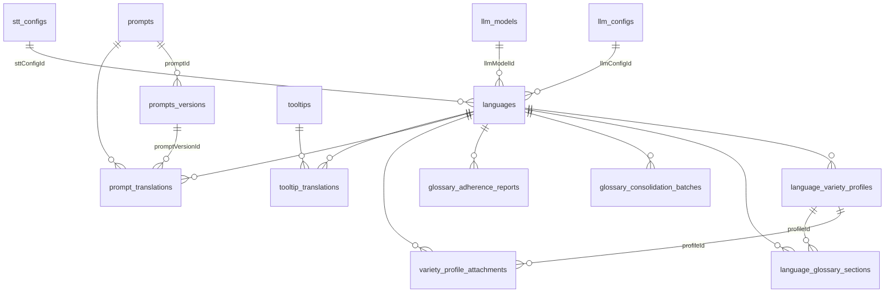

---

## 8. Analytics, Lab & Bug Hunter

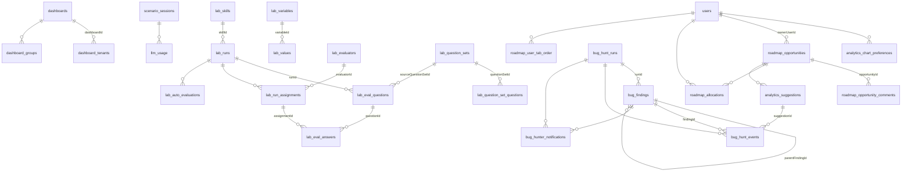

---

## Standalone tables (no `*Id` references either way)

`analytics_quality_thresholds`, `eval_experiments`, `cloud_telephony_integrations`, `blogs`,
`comfort_audio_tracks`, `conversational_guardrails`, `filler_tags`, `learn_room_metadata`,
`places`, `global_settings`, `preferences`, `scenario_cover_image_library`,
`roadmap_opportunity_owners`, `roadmap_saved_views`, `roadmap_product_goals`,
`roadmap_interview_notes`, `bug_hunter_settings`, `reference_documents` (`organizationId` only).
